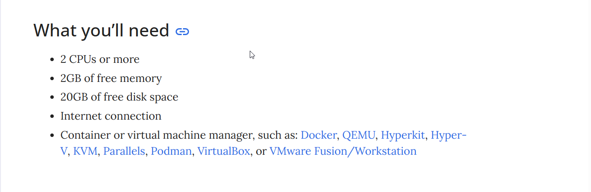
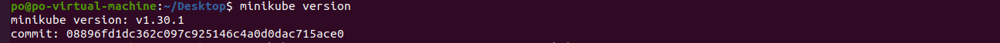
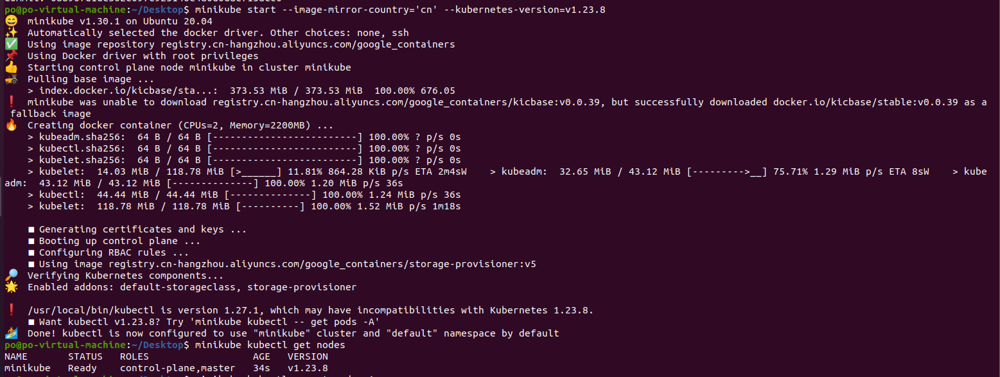
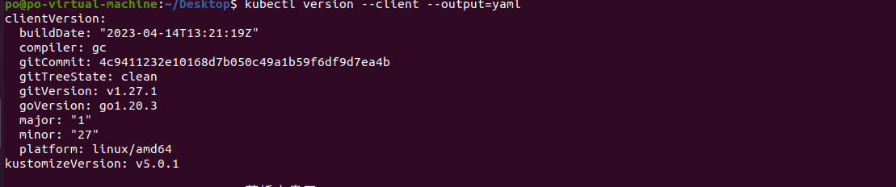
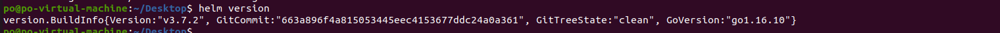
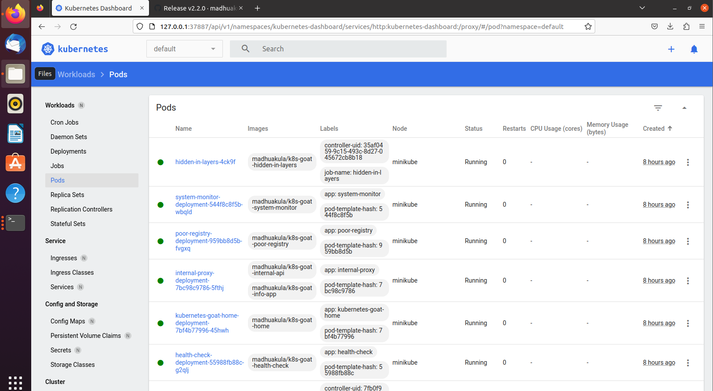

# cloudSecurityLearn
## 0x01 前言

旨在记录云安全相关的学习。

目前部署实现了相关靶场并编写其wp。

1. [madhuakula/kubernetes-goat: Kubernetes Goat is a "Vulnerable by Design" cluster environment to learn and practice Kubernetes security using an interactive hands-on playground 🚀 (github.com)](https://github.com/madhuakula/kubernetes-goat)

## 0x02 kubernetes(k8s)

[Kubernetes（k8s）基础概念介绍 (qq.com)](https://mp.weixin.qq.com/s/u_XzQbKnv0CFhbv3417yUA)

[14个K8S必备基础概念 (qq.com)](https://mp.weixin.qq.com/s/6G1XX4cwhyLX59G95KB86Q)

[T Wiki (teamssix.com)](https://wiki.teamssix.com/)

## 0x03 k8s环境搭建

环境：vmware + ubuntu-20.04.6-desktop-amd64.iso

**ps:docker及镜像加速，linux换源等请自行配置**

### minikube

Minikube 是**一种轻量级的Kubernetes 实现，可在本地计算机上创建VM 并部署仅包含一个节点的简单集群**。 Minikube 可用于Linux ， macOS 和Windows 系统。 Minikube CLI 提供了用于引导集群工作的多种操作，包括启动、停止、查看状态和删除。

#### 需要配置



#### 安装minikube

```
curl -LO https://storage.googleapis.com/minikube/releases/latest/minikube-linux-amd64
sudo install minikube-linux-amd64 /usr/local/bin/minikube
```

#### 验证minikube

```
minikube version
```



#### 创建一个集群

```
minikube start --image-mirror-country='cn' --kubernetes-version=v1.23.8
```



耐心等待即可配置完成。这里使用minikube内置的`kubectl`可以发现，已经配置了一个k8s的集群。

#### 安装kubectl

Kubernetes 提供kubectl 是**使用Kubernetes API 与Kubernetes 集群的控制面进行通信的命令行工具**

我们只需要使用`kubectl`命令来操控集群即可，当然minikube也有内置的`kubectl`命令，但是并不好用。

```
curl -LO "https://dl.k8s.io/release/$(curl -L -s https://dl.k8s.io/release/stable.txt)/bin/linux/amd64/kubectl"
sudo install -o root -g root -m 0755 kubectl /usr/local/bin/kubectl
```

验证

```
kubectl version --client --output=yaml
```



#### 安装helm

`helm`是 Kubernetes 的包管理工具，类似于apt || yum || pip。

```
wget https://get.helm.sh/helm-v3.7.2-linux-amd64.tar.gz
tar zxvf helm-v3.7.2-linux-amd64.tar.gz
mv linux-amd64/helm /usr/local/bin/helm
```

验证



#### 配置web界面

```
minikube dashboard
```


虚拟机直接访问给出的link即可，如果要物理机访问好像是需要配置一下代理，这边直接虚拟机内访问即可。



### Kind

//TODO

### kubeadm

//TODO

