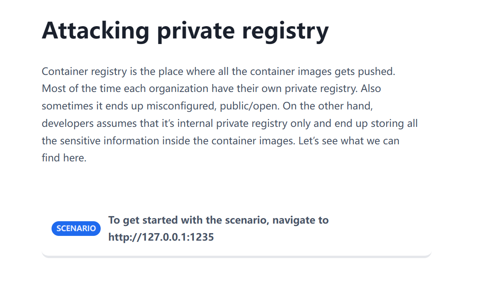
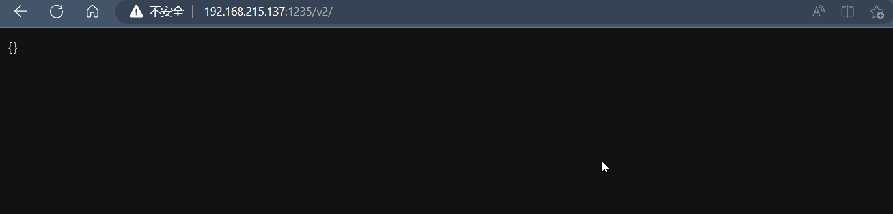
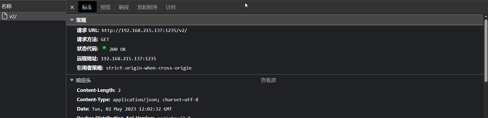
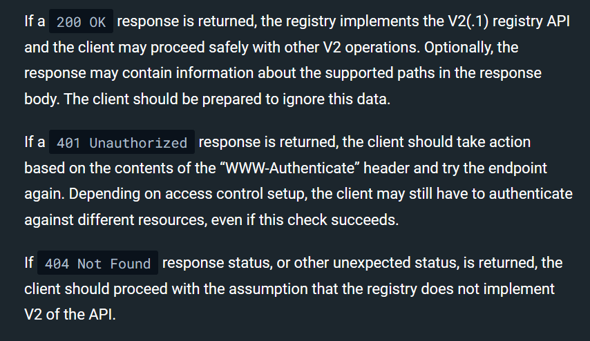
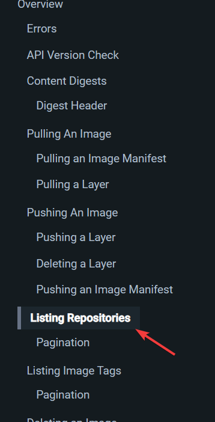
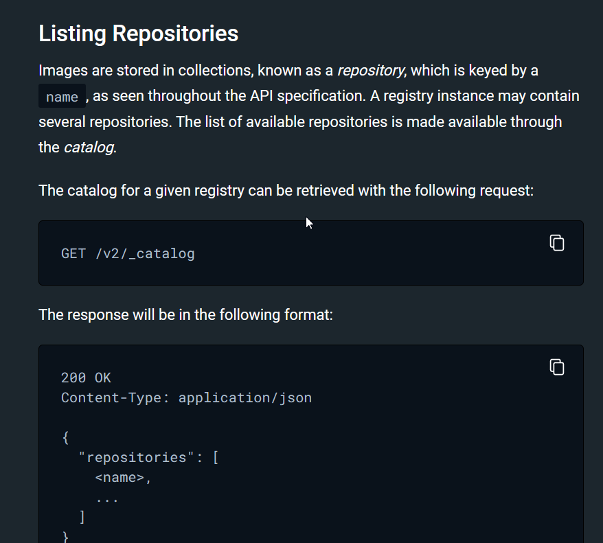
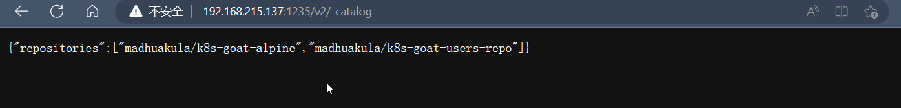
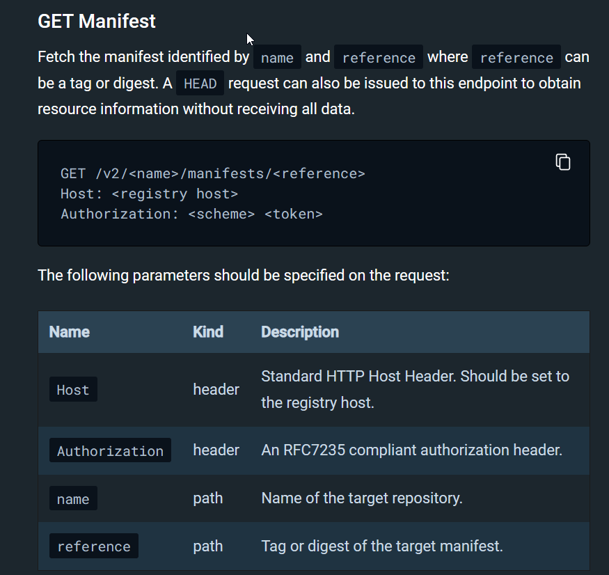
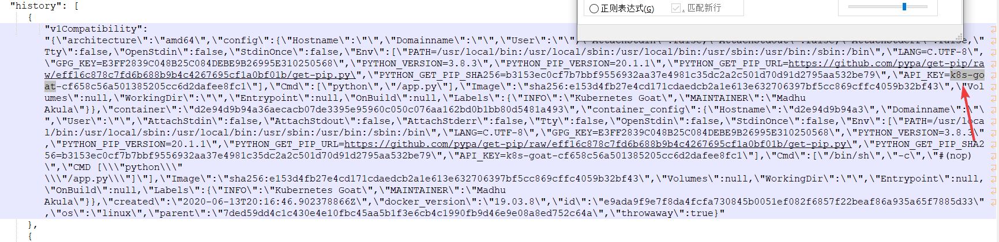

# Attacking private registry

## Story



## Exploitation

关于docker注册表的v2的api查询可以查看[官方文档](https://docs.docker.com/registry/spec/api/)。

首先是确定api是否可用，尝试访问一下

```
GET /v2/
```



通过HTTP状态码，我们也可以知道api v2是处于**可用、未授权、不存在**的哪种状态。





可以发现，状态码返回200，我们是可以安全使用api v2的。

现在作为hacker，我们需要进一步的获取信息。

通过官网的右边目录栏，我们可以快速查询需要的api，现在目前我们处于黑盒的状态无法知道有哪些信息可以查询，那么就需要list所用信息。





现在我知道通过

```
GET /v2/_catalog
```

可以列出所有仓库。



列出仓库后，我们需要进一步获取仓库信息，继续查询api。



通过仓库名 + tag，我们就可以进一步获取该仓库的信息。

```
GET /v2/madhuakula/k8s-goat-users-repo/manifests/latest
```

最后下载一个文件下来，找一找就可以找到flag。


