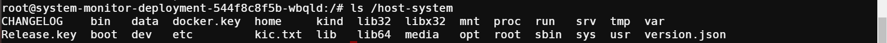

# Container escape to the host system

## Story


## Exploitation

又是关于docker逃逸的。

以常规的渗透思路，首先得判断自己是不是在docker内。

 首先，需要判断系统是否处于docker容器中。

1. 检查/.dockerenv文件是否存在。

   ```
   ls -alh
   ```

   如果是非docker是不存在`/.dockerenv`文件的。

2. Control Group，检查/proc/1/cgroup内是否包含"docker"等字符串。

   ```
   cat /proc/1/cgroup | grep -c "docker"  //输出含docker字符串行号
   ```

3. 检查是否存在container环境变量

   通过env\PATH来检查是否有docker相关的环境变量，来进一步判断。

4. 如检测mount、fdisk -l查看硬盘、判断PID 1的进程名等也可用来辅助判断

通过检测`./dockerenv`可以发现处在容器内


查看挂载目录

```
mount
```


可以发现，`/host-system`里面存在`etc`等文件夹，很有可能挂载了宿主机的根目录。



Kubernetes节点配置可以在默认路径找到，节点级kubelet使用该配置与Kubernetes API服务器对话。如果你能使用这个配置，你就能获得与Kubernetes节点相同的权限

通常可以在默认路径找到。

```
cat /host-system/etc/kubernetes/kubelet.conf
或者
cat /host-system/var/lib/kubelet/kubeconfig
```


利用这个配置结合`kubectl`命令我们就可以与Kubernetes API服务器通信。

在根目录，我们可以找到`kubectl`的一个二进制文件，给它一个可执行的权限

```
chmod +x kubectl
```

然后把`kubectl`二进制文件移动到`host-system`文件夹内，然后利用配置与Kubernetes API服务器通信

```
mv kubectl host-system
chroot /host-system bash
/kubectl --kubeconfig /etc/kubernetes/kubelet.conf get all -n kube-system
```


这里我们用`chroot`命令将当前进程切换到`/host-system`目录下，并启动一个新的`bash shell`进程的原因是`kubelet.conf`文件中配置的一些绝对路径因为文件系统是挂载而不是宿主机的原因，导致路径不匹配了，不能准确的找到，所以需要切换一下根目录。

到这里，我们就可以利用`kubectl`命令操纵Kubernetes 集群进行进一步的渗透。

