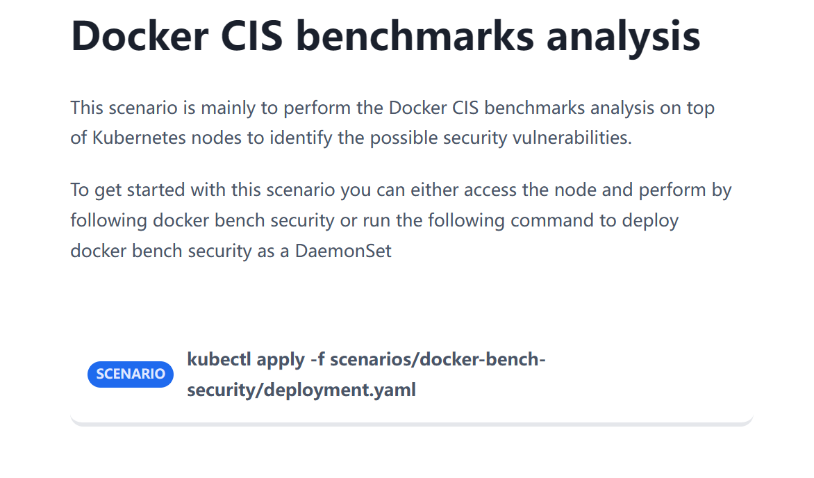
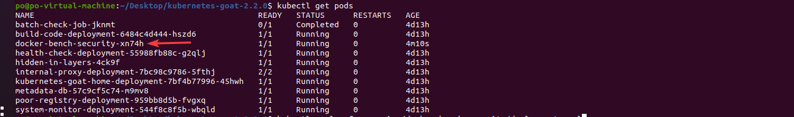
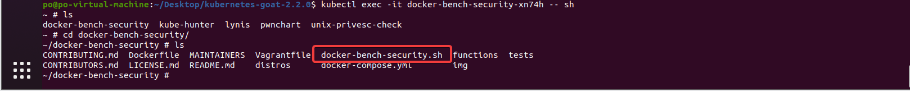
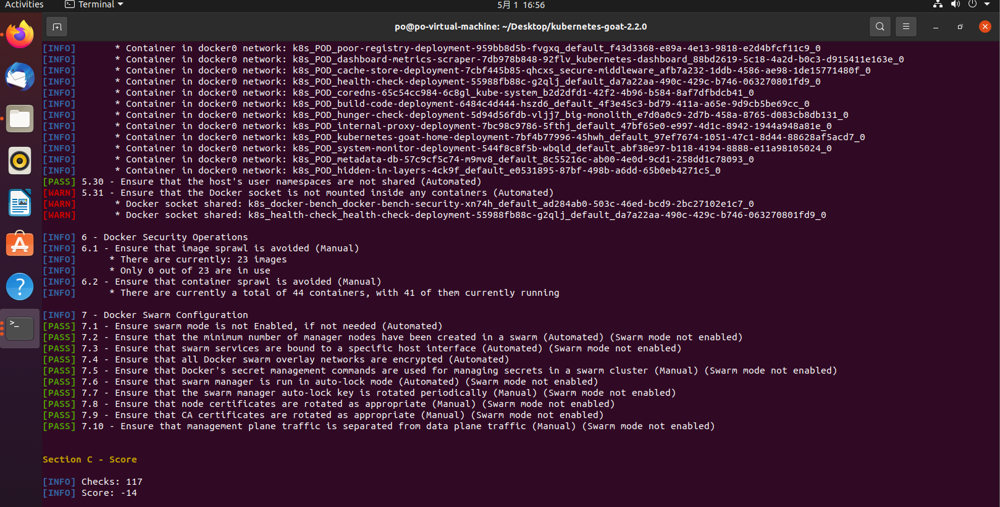
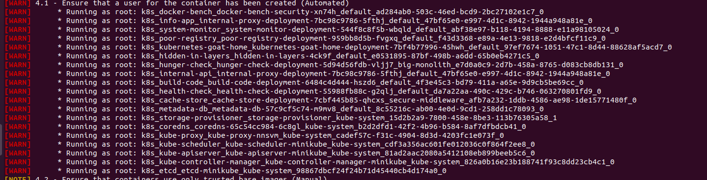
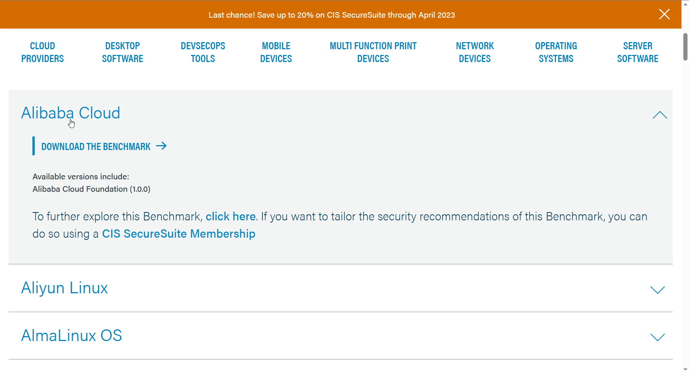
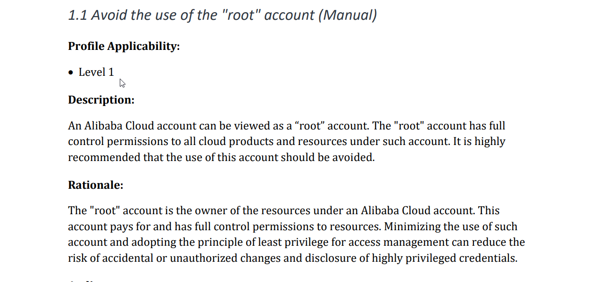

# Docker CIS benchmarks analysis

## Stroy



## Solution

> Docker CIS benchmarks analysis是指对Docker容器进行安全配置检查的过程，检查是否符合CIS（Center for Internet Security）公布的安全基准规范。CIS基准规范是一组针对各种技术的安全配置建议，旨在帮助企业加强其IT系统的安全性。Docker CIS benchmarks analysis可以帮助您确保Docker容器的安全配置达到最佳实践水平，并且能够发现和修复潜在的安全漏洞。

我们可以使用goat给的pod，容器里面自带了基于CIS标准的检测脚本。

关于这个检测脚本，可以查看这个[github项目](https://github.com/docker/docker-bench-security)。

```
kubectl apply -f scenarios/docker-bench-security/deployment.yaml
kubectl get pods
```



进入这个pod

```
kubectl exec -it docker-bench-security-xn74h -- sh
```



```
cd docker-bench-security
sh docker-bench-security.sh
```

其实也支持使用容器进行检测，具体还是参考上面的github项目。



相应的结果不仅输出到了命令行，也保存到了`./log`目录下，以文本和json的形式。

我们可以查看一些返回的结果。



比如这里，警告我们不要以ROOT权限运行容器，并举例了以ROOT权限运行的容器。

关于CIS标准的更多信息，我们也可以去[官网](https://www.cisecurity.org/cis-benchmarks)上查看，不只是Docker的CIS。



只需要填写一些基础信息，就可以以PDF的形式下载一些CIS标准的信息，我们这边下载一个阿里云的试试。



比如第一条，就让我们避免使用root账户，因为root账户有完整的控制权限，这可能会导致一些安全问题。
