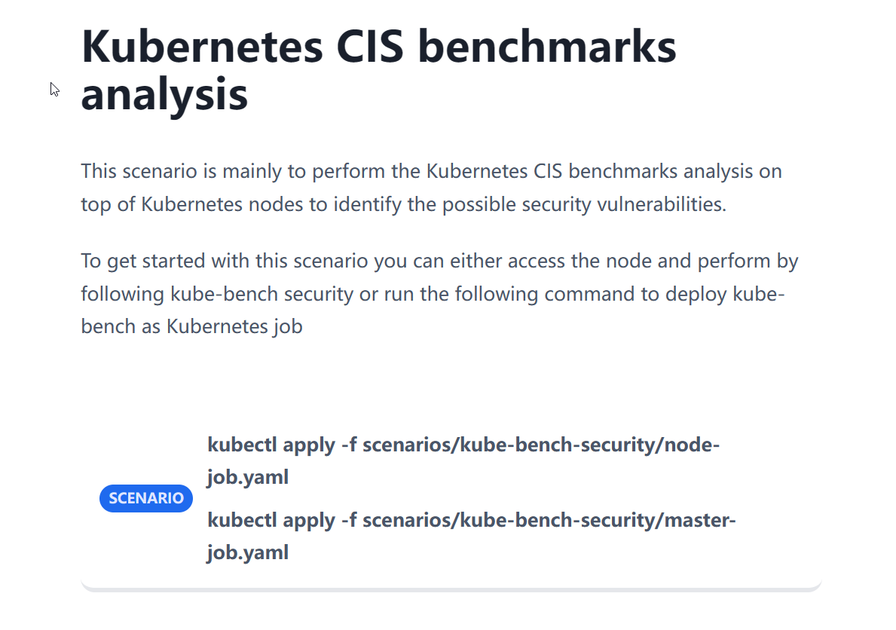
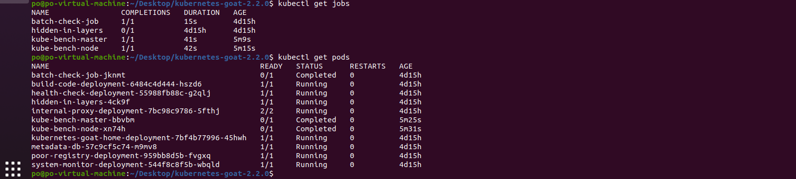
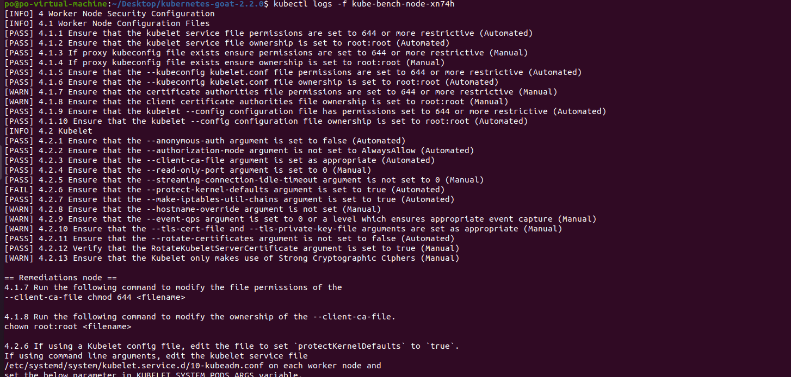
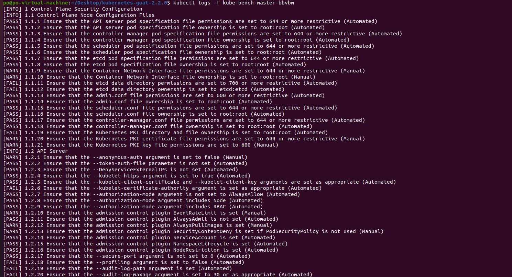

# Kubernetes CIS benchmarks analysis

## Story



## Solution

```
kubectl apply -f scenarios/kube-bench-security/node-job.yaml

kubectl apply -f scenarios/kube-bench-security/master-job.yaml
```



```
kubectl logs -f kube-bench-node-xn74h
```



```
kubectl logs -f kube-bench-master-bbvbm
```



关于其它CIS的更多信息，请查看同目录下的**Docker CIS benchmarks analysis**这篇文章。