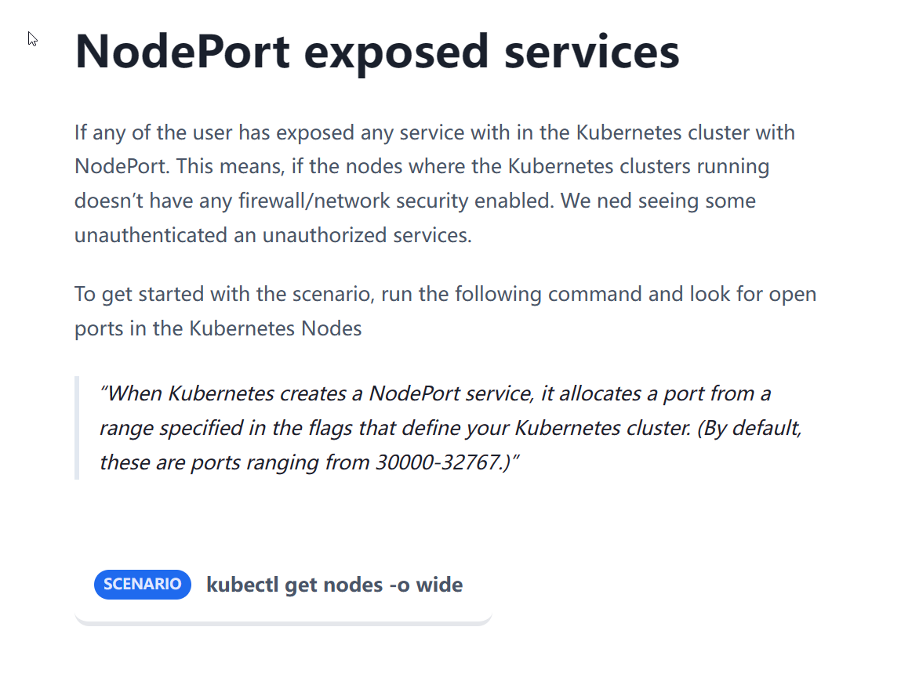
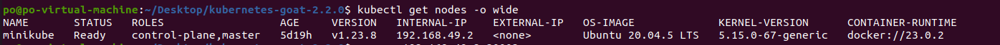
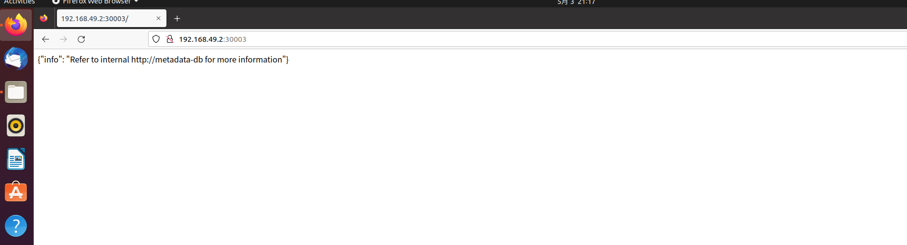

# NodePort exposed services

## Story



## Exploitation

关于NodePort暴露的服务，这边就不扫了，其实写个简单的py脚本就可以了，直接给最后payload。

因为没有外网IP，这里用内网IP`192.168.49.2`是一样的。NodePort通常暴露在`30000-32767`的端口列表中。



```
nc -zv EXTERNAL-IP-ADDRESS 30003
```


回显为`succeeded`，这时候我们可以用浏览器访问一下。



截获隐藏信息。
