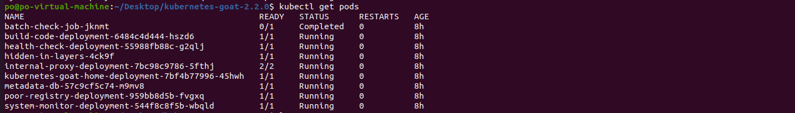
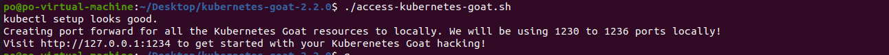
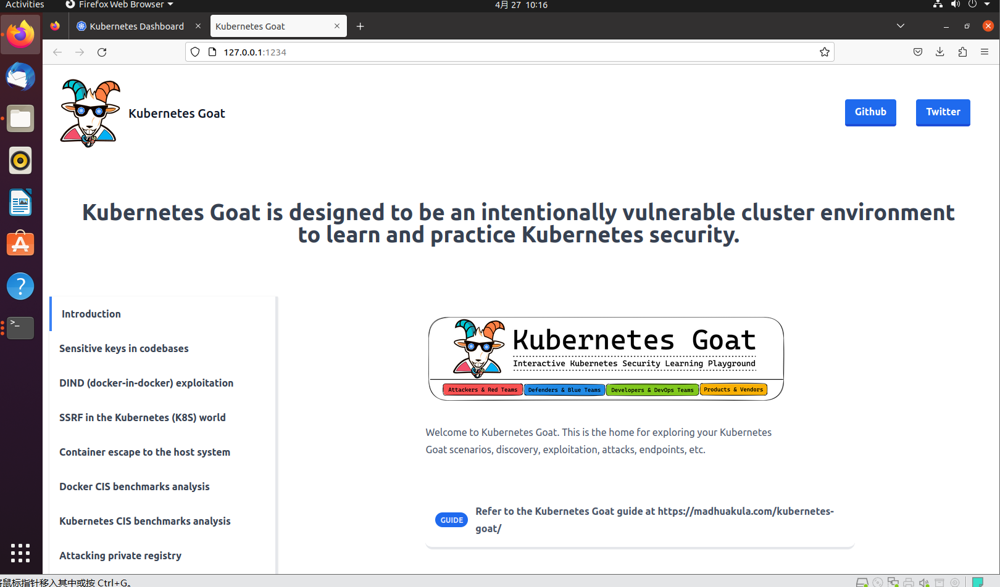

# kubernetes-goat

## 0x01 前言

记录[kubernetes-goat](https://github.com/madhuakula/kubernetes-goat)靶场的环境搭建过程以及渗透过程。

## 0x02 环境搭建

需要先按照主页面README.md搭建好k8s环境，再运行相应脚本。

官方网站：[☸️ Kubernetes | Kubernetes Goat (madhuakula.com)](https://madhuakula.com/kubernetes-goat/docs/how-to-run/kubernetes-goat-on-kubernetes)

这边直接使用已经[Releases](https://github.com/madhuakula/kubernetes-goat/releases)的版本比较稳定。

```
cd kubernetes-goat-2.2.0
chmod +x setup-kubernetes-goat.sh
./setup-kubernetes-goat.sh
```

确保在运行 access-kubernetes-goat.sh 之前pods都正常运行

```
kubectl get pods
```



```
chmod +x access-kubernetes-goat.sh
./access-kubernetes-goat.sh
```



访问链接http://127.0.0.1:1234/



后续的渗透均使用局域网地址，例如http://192.168.215.137:1234。
