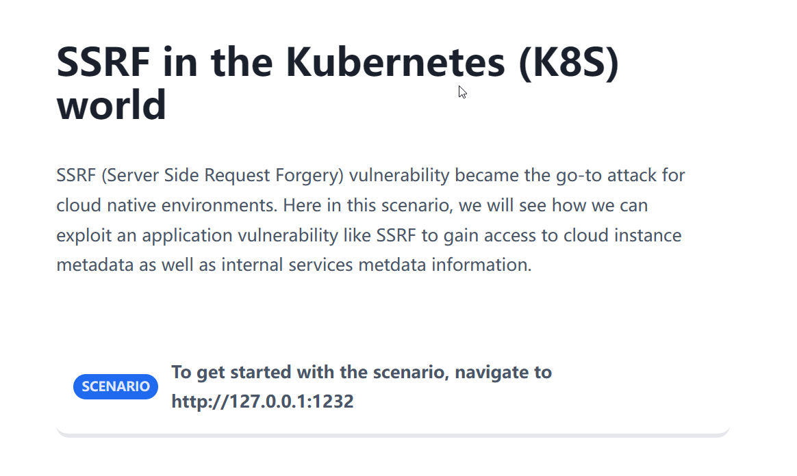
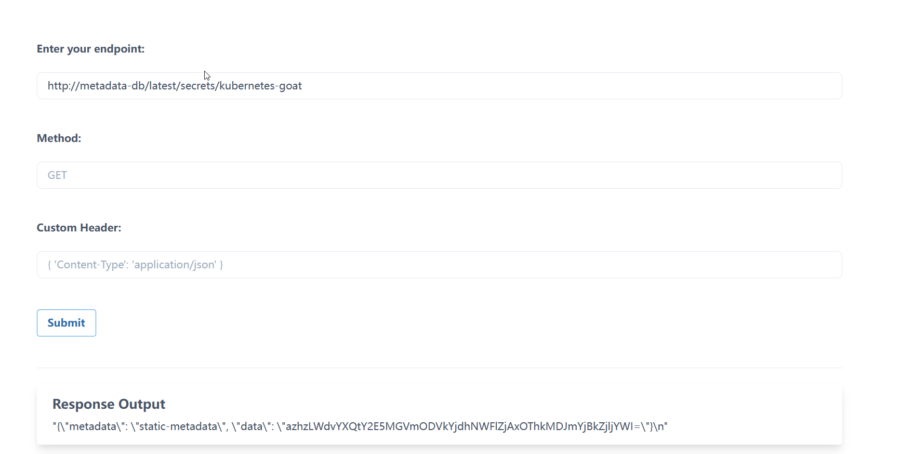
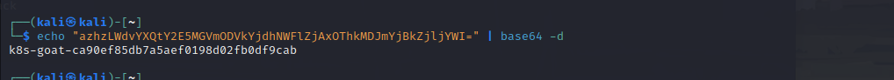

# SSRF in the Kubernetes (K8S) world

## Story



## Exploitation

其实就是通过SSRF去枚举和访问服务，这边直接给最终payload了

```
http://metadata-db/latest/secrets/kubernetes-goat
```



base64解码得到flag



这边官方给出了一个关于hackerone的真实案例，还是挺有意思的。

[Shopify | Report #341876 - SSRF in Exchange leads to ROOT access in all instances | HackerOne](https://hackerone.com/reports/341876)

想不到信息泄露能造成的危害竟然这么大，目前远程通信越来越发达，信息泄露造成的危害也就更大了，也许泄露的比如说公钥和私钥就可能造成远程RCE。

