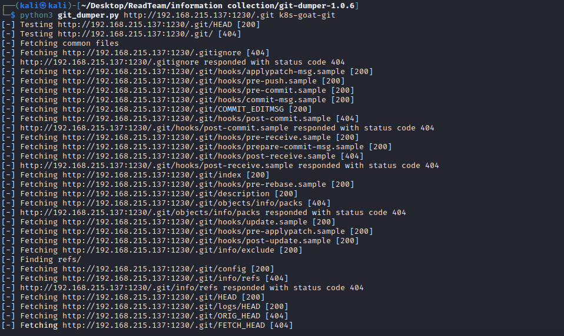
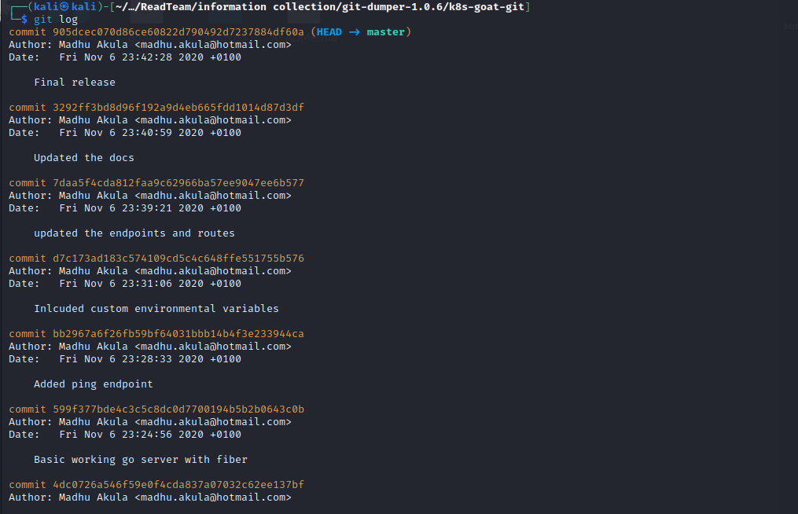

# Sensitive keys in codebases

## Story


## Exploitation

### Method1

进入题目


从题干可以知道，可能用了git提交代码，这里面可能存在暴露的文件夹，例如**.git**。

访问`http://192.168.215.137:1230/.git/config`


存在暴露的`.git`文件夹，使用[git-dumper](https://github.com/arthaud/git-dumper)尝试把可能存在的文件dump出来。

```
python3 git_dumper.py http://192.168.215.137:1230/.git k8s-goat-git
```



进入**k8s-goat-git**


可以发现我们dump下来了一些文件，并且里面就有**.git**文件，这时候我们就可以用`git log`命令去查看它历史提交的commit

```
git log
```



在切换了几条分支后，可以发现有一条分支比较有趣。

```
git checkout d7c173ad183c574109cd5c4c648ffe551755b576
```


这里面还保存着一个**.env**文件。


查看**.env**文件拿到flag，同时这里面还保存着**aws_access_key_id**和**aws_secret_access_key**

### Method2

理想情况下，我们通过其它漏洞拿到了k8s master机器的权限，也可以通过`kubectl`去进入pods去搜集信息。


进入`build-code-deployment-6484c4d444-hszd6`

```
kubectl exec -it build-code-deployment-6484c4d444-hszd6 -- sh
```


使用[trufflehog](https://github.com/trufflesecurity/trufflehog)做信息搜集。


这个工具会自己去对`git`做信息搜集，也有其它的利用方式，参考工具github页面。

一样找到了泄露的key&flag。


